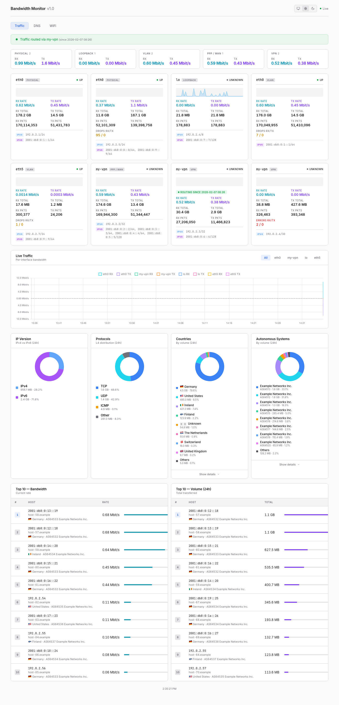
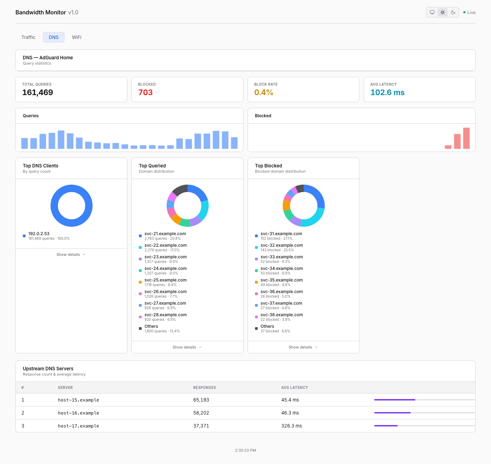
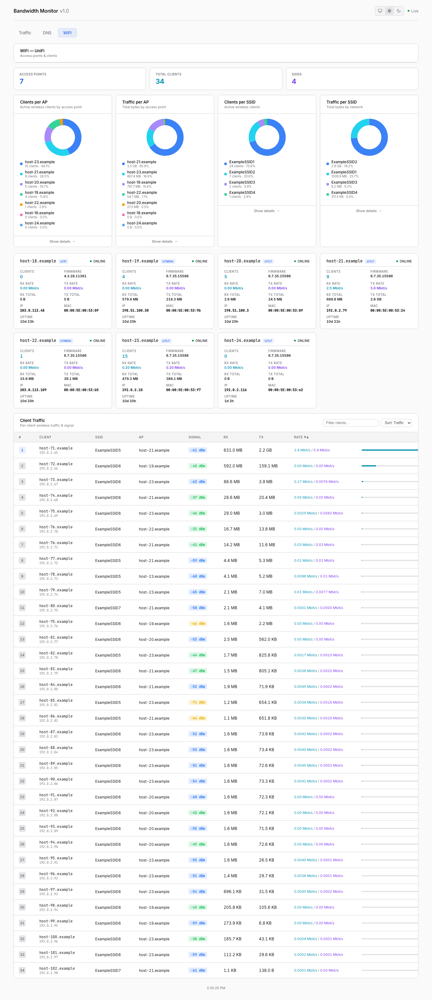
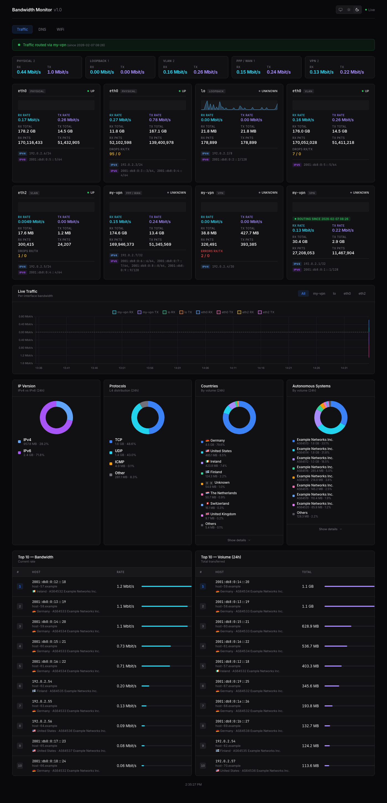
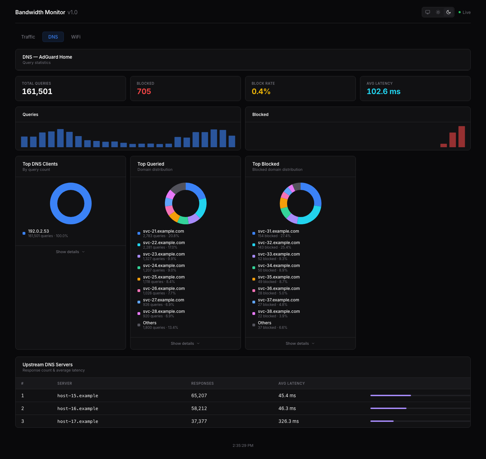
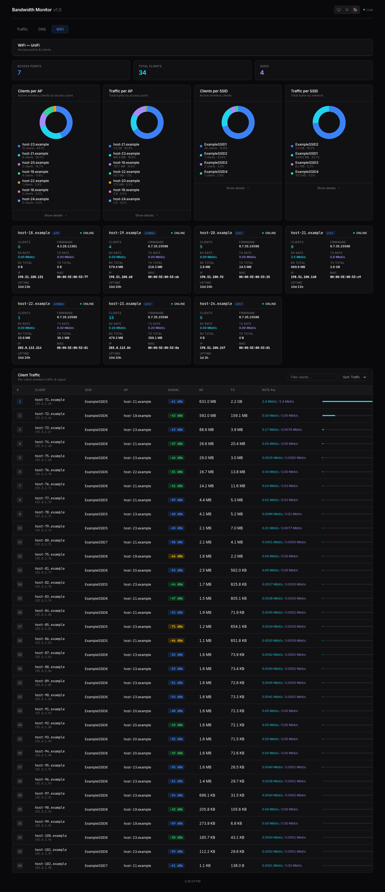

# Bandwidth Monitor

A real-time network monitoring dashboard for Linux, written in Go. 

Single-binary deployment with an embedded web UI, optional DNS stats (AdGuard Home or NextDNS), UniFi wireless monitoring, GeoIP enrichment, and a macOS menu bar plugin.

## Features

### Traffic Tab
- **Live interface stats** — reads `/proc/net/dev` every second; shows RX/TX rates, totals, packets, errors, and drops per interface
- **Interface grouping** — auto-classifies interfaces as Physical, VLAN, PPP/WAN, VPN, or Loopback
- **VPN routing detection** — configurable sentinel files to show whether a VPN interface is actively routing traffic
- **Real-time line chart** — Chart.js with per-interface filtering and 1-hour sliding window
- **Per-interface sparklines** — mini inline charts on each interface card
- **Top talkers by bandwidth** — live transfer rates via packet capture (gopacket/libpcap)
- **Top talkers by volume** — rolling 24-hour totals with 1-minute bucket aggregation
- **Protocol breakdown** — TCP / UDP / ICMP / Other pie chart
- **IP version breakdown** — IPv4 vs IPv6 traffic split
- **GeoIP enrichment** — country flags, ASN org names via MaxMind MMDB files
- **Reverse DNS** — resolves IPs to hostnames with in-memory cache

### DNS Tab
- **AdGuard Home or NextDNS integration** — total queries, blocked count/percentage, average latency
- **Time-series charts** — queries and blocked requests over time
- **Top clients, domains, and blocked domains** — pie charts + ranked detail tables
- **Upstream DNS servers** — response counts and average latency

### WiFi Tab
- **UniFi controller integration** — polls AP and client data from the UniFi API
- **AP cards** — per-AP status, clients, firmware, uptime, IP, MAC, live RX/TX rates
- **Clients per AP / per SSID** — pie charts and detail tables
- **Traffic per AP / per SSID** — cumulative bytes + live rates
- **Per-client traffic table** — hostname, IP, SSID, AP, signal strength (color badges), RX/TX totals, live rates
- **Search & sort** — filter clients by name/IP/MAC/SSID/AP; sort by traffic, rate, name, or signal

### General
- **WebSocket live updates** — 1-second refresh with automatic reconnection
- **Dark/light/auto theme** — saved to localStorage
- **Fully embedded UI** — all HTML/CSS/JS baked into the binary via `go:embed`
- **macOS menu bar plugin** — SwiftBar/xbar script showing live stats

## Requirements

- **Linux** — reads `/proc/net/dev` and `/sys/class/net/`
- **libpcap-dev** — for packet capture (top talkers)
- **Go 1.24+** — to build

```bash
# Debian/Ubuntu
sudo apt install libpcap-dev

# RHEL/Fedora
sudo dnf install libpcap-devel

# Arch
sudo pacman -S libpcap
```

## Quick Start

```bash
# Build
make build

# Download GeoIP databases (optional, free)
make geoip

# Run (needs root or CAP_NET_RAW for packet capture)
sudo ./bandwidth-monitor
```

Then open **http://localhost:8080**.

## Configuration

All configuration is via environment variables. Copy the example file and edit:

```bash
cp env.example /opt/bandwidth-monitor/.env
chmod 0600 /opt/bandwidth-monitor/.env
```

### Environment Variables

| Variable | Default | Description |
|----------|---------|-------------|
| `LISTEN` | `:8080` | HTTP listen address (e.g. `198.51.100.1:8080`) |
| `DEVICE` | *(all)* | Network device for packet capture (e.g. `eth0`) |
| `PROMISCUOUS` | `true` | Enable promiscuous mode for packet capture (`true`/`false`) |
| `GEO_COUNTRY` | `GeoLite2-Country.mmdb` | Path to GeoLite2 Country MMDB |
| `GEO_ASN` | `GeoLite2-ASN.mmdb` | Path to GeoLite2 ASN MMDB |
| `ADGUARD_URL` | *(disabled)* | AdGuard Home base URL (e.g. `http://adguard.example.net`) |
| `ADGUARD_USER` | | AdGuard Home username |
| `ADGUARD_PASS` | | AdGuard Home password |
| `NEXTDNS_PROFILE` | *(disabled)* | NextDNS profile ID (e.g. `abc123`) |
| `NEXTDNS_API_KEY` | | NextDNS API key (from [my.nextdns.io/account](https://my.nextdns.io/account)) |
| `UNIFI_URL` | *(disabled)* | UniFi controller URL (e.g. `https://unifi.example.net:8443`) |
| `UNIFI_USER` | | UniFi controller username |
| `UNIFI_PASS` | | UniFi controller password |
| `UNIFI_SITE` | `default` | UniFi site name |
| `VPN_STATUS_FILES` | *(none)* | Comma-separated `iface=path` pairs for VPN routing detection (e.g. `wg0=/run/wg0-active`) |
| `LOCAL_NETS` | *(auto-detect)* | Comma-separated CIDRs for RX/TX direction detection (e.g. `192.0.2.0/24,2001:db8::/48`). Auto-discovered from local interfaces if not set. |

The DNS tab supports either **AdGuard Home** or **NextDNS** (mutually exclusive; AdGuard takes priority if both are configured). The WiFi tab is only shown when UniFi is configured.

The UniFi integration auto-detects both legacy controllers (port 8443) and UniFi OS devices (UDM/UDR/CloudKey Gen2+, port 443).

### RX/TX Direction Detection

The top-talkers tables show per-host RX (download) and TX (upload) columns. Local network ranges are **auto-discovered** from interface addresses at startup — no configuration needed in most cases.

For SPAN/mirror port setups or if auto-discovery doesn't cover all your addresses (e.g. dynamic ISP prefixes), set `LOCAL_NETS` explicitly — similar to iftop's `-F`/`-G` flags:

```bash
LOCAL_NETS=192.0.2.0/24,2001:db8::/48
```

### VPN Routing Detection (OpenWrt)

The `VPN_STATUS_FILES` variable tells bandwidth-monitor which sentinel files to check for active VPN routing. On OpenWrt, a hotplug script (`99-vpn-status`) is included that automatically creates and removes these sentinel files when WireGuard interfaces go up or down.

The script is installed automatically with the OpenWrt package to `/etc/hotplug.d/iface/99-vpn-status`. It reads `VPN_STATUS_FILES` from `/etc/bandwidth-monitor/env` — the same file the main service uses — so there is nothing extra to configure:

```bash
# In /etc/bandwidth-monitor/env
VPN_STATUS_FILES=wg0=/run/wg0-active,wg1=/run/wg1-active
```

When `wg0` comes up, the hotplug script writes a timestamp to `/run/wg0-active`. When it goes down, the file is removed. The dashboard shows a 🔒 icon on interfaces that are actively routing.

## Installation

### Pre-built packages

Pre-built packages are available from [GitHub Releases](https://github.com/awlx/bandwidth-monitor/releases) for:

| Format | Architectures | Platform |
|--------|--------------|----------|
| `.deb` | amd64, arm64 | Debian, Ubuntu, Raspbian |
| `.rpm` | amd64, arm64 | Fedora, RHEL, AlmaLinux |
| `.ipk` | x86_64, aarch64, mips_24kc, mipsel_24kc | OpenWrt 23.05 (stable) |
| `.apk` | x86_64, aarch64 | OpenWrt snapshot (nightly) |

#### Debian / Ubuntu

```bash
sudo dpkg -i bandwidth-monitor_*.deb
sudo vi /etc/bandwidth-monitor/env
sudo systemctl enable --now bandwidth-monitor
```

#### RHEL / Fedora

```bash
sudo rpm -i bandwidth-monitor-*.rpm
sudo vi /etc/bandwidth-monitor/env
sudo systemctl enable --now bandwidth-monitor
```

#### OpenWrt (stable, opkg)

```bash
opkg update && opkg install libpcap
opkg install /tmp/bandwidth-monitor_*.ipk
vi /etc/bandwidth-monitor/env
/etc/init.d/bandwidth-monitor enable
/etc/init.d/bandwidth-monitor start
```

Optional GeoIP databases:
```bash
scp GeoLite2-Country.mmdb GeoLite2-ASN.mmdb root@router:/etc/bandwidth-monitor/
/etc/init.d/bandwidth-monitor restart
```

#### OpenWrt (snapshot, apk)

```bash
apk update && apk add libpcap
apk add --allow-untrusted /tmp/bandwidth-monitor-*.apk
vi /etc/bandwidth-monitor/env
/etc/init.d/bandwidth-monitor enable
/etc/init.d/bandwidth-monitor start
```

### Using the Makefile

```bash
# Build, download GeoIP DBs, install to /opt/bandwidth-monitor,
# set up systemd service, and start
make install
```

This will:
1. Build the binary
2. Download GeoIP databases if not present
3. Copy everything to `/opt/bandwidth-monitor/`
4. Create `.env` from `env.example` (if it doesn't exist)
5. Install and enable the systemd service

```bash
# Check status
systemctl status bandwidth-monitor

# View logs
journalctl -u bandwidth-monitor -f

# Uninstall everything
make uninstall
```

### Manual

```bash
go build -o bandwidth-monitor .
sudo mkdir -p /opt/bandwidth-monitor
sudo cp bandwidth-monitor /opt/bandwidth-monitor/
sudo cp env.example /opt/bandwidth-monitor/.env
sudo chmod 0600 /opt/bandwidth-monitor/.env
# Edit .env with your settings
sudo cp bandwidth-monitor.service /etc/systemd/system/
sudo systemctl daemon-reload
sudo systemctl enable --now bandwidth-monitor
```

### Systemd Service

The included `bandwidth-monitor.service` runs the binary with:
- `CAP_NET_RAW` for packet capture (no full root needed)
- `ProtectSystem=strict`, `ProtectHome=yes`, `PrivateTmp=yes` hardening
- Environment loaded from `/opt/bandwidth-monitor/.env`

## macOS Menu Bar Plugin

A [SwiftBar](https://github.com/swiftbar/SwiftBar) / [xbar](https://xbarapp.com/) plugin is included at `swiftbar/bandwidth-monitor.5s.sh`. It shows live RX/TX rates, DNS stats, and WiFi client counts in the macOS menu bar.

**Dependencies:** `curl`, `jq` (install via `brew install jq`)

**Setup:**
1. Copy `swiftbar/bandwidth-monitor.5s.sh` to your SwiftBar plugin directory
2. Make it executable: `chmod +x bandwidth-monitor.5s.sh`
3. Edit the defaults at the top of the script, or set environment variables

**Configuration via environment variables:**

| Variable | Default | Description |
|----------|---------|-------------|
| `BW_SERVERS` | `http://localhost:8080` | Comma-separated list of servers to try in order (first reachable wins) |
| `BW_SERVER` | `http://localhost:8080` | Single server URL (used if `BW_SERVERS` is not set) |
| `BW_PREFER_IFACE` | *(auto)* | Default preferred interface for menu bar title (e.g. `ppp0`) |
| `BW_PREFER_IFACE_MAP` | *(none)* | Per-server interface override: `url=iface,url=iface` |

**Multi-server example** (edit the defaults in the script):
```bash
SERVERS="http://198.51.100.1:8080, http://203.0.113.1:8080"
PREFER_IFACE_MAP="http://198.51.100.1:8080=eth0,http://203.0.113.1:8080=ppp0"
```

The plugin tries each server in order with a 1-second timeout. The preferred interface is resolved per-server from the map. Shows a 🔒 icon when VPN routing is active.

## Architecture

```
main.go                   → entry point, env config, wires all components
collector/                → reads /proc/net/dev, computes rates, 24h history, VPN routing
talkers/                  → pcap packet capture, per-IP tracking, 1-min bucket aggregation
handler/                  → HTTP REST API + WebSocket handler
dns/                      → common DNS provider interface
adguard/                  → AdGuard Home API client (stats, top clients/domains)
nextdns/                  → NextDNS API client (stats, top clients/domains)
unifi/                    → UniFi controller API client (APs, SSIDs, clients, live rates)
geoip/                    → MaxMind MMDB GeoIP lookups (country, ASN)
static/
  index.html              → HTML shell with three tabs
  app.js                  → all frontend JavaScript (charts, tables, WebSocket)
  style.css               → full stylesheet (dark/light themes, glassmorphism)
swiftbar/                 → macOS menu bar plugin
packaging/
  openwrt-Makefile        → OpenWrt package definition
  openwrt-files/
    bandwidth-monitor.init → procd init script for OpenWrt
    99-vpn-status         → OpenWrt hotplug script for VPN sentinel files
  postinstall.sh          → deb/rpm post-install script
  preremove.sh            → deb/rpm pre-remove script
nfpm.yaml                 → deb/rpm packaging config (nfpm)
.github/workflows/        → CI: builds deb, rpm, ipk, apk on push & tag
nfpm.yaml                 → deb/rpm packaging config (nfpm)
.github/workflows/        → CI: builds deb, rpm, ipk, apk on push & tag
env.example               → example environment configuration
bandwidth-monitor.service → systemd unit file
Makefile                  → build, install, GeoIP download targets
```

## API Endpoints

| Endpoint | Method | Description |
|----------|--------|-------------|
| `/api/interfaces` | GET | Current stats for all interfaces |
| `/api/interfaces/history` | GET | 24h time-series per interface |
| `/api/talkers/bandwidth` | GET | Top 10 by current bandwidth |
| `/api/talkers/volume` | GET | Top 10 by 24h volume |
| `/api/dns` | GET | DNS summary (AdGuard Home or NextDNS) |
| `/api/wifi` | GET | UniFi WiFi summary |
| `/api/summary` | GET | Compact summary for menu bar clients |
| `/api/ws` | WS | WebSocket — pushes all data every second |

## Screenshots

<table>
  <tr>
    <th>Traffic (Light)</th>
    <th>DNS (Light)</th>
    <th>WiFi (Light)</th>
  </tr>
  <tr>
    <td></td>
    <td></td>
    <td></td>
  </tr>
  <tr>
    <th>Traffic (Dark)</th>
    <th>DNS (Dark)</th>
    <th>WiFi (Dark)</th>
  </tr>
  <tr>
    <td></td>
    <td></td>
    <td></td>
  </tr>
</table>

## Notes

- **Interface stats** work without root — they just read `/proc/net/dev`
- **Top talkers** require `root` or `CAP_NET_RAW` for packet capture
- If running without root, the UI works but top-talker tables show "No data"
- **GeoIP** is optional — without MMDB files, country/ASN columns are simply hidden
- **DNS and WiFi** tabs only appear when their respective integrations are configured
- All assets are embedded in the binary — single-file deployment, no runtime dependencies
