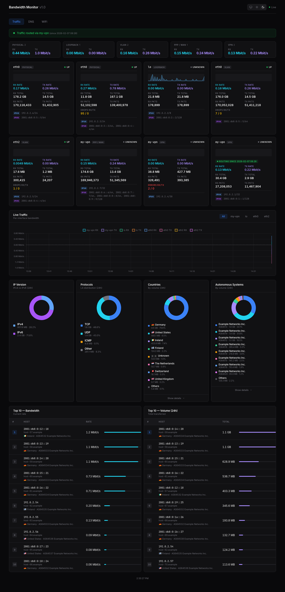
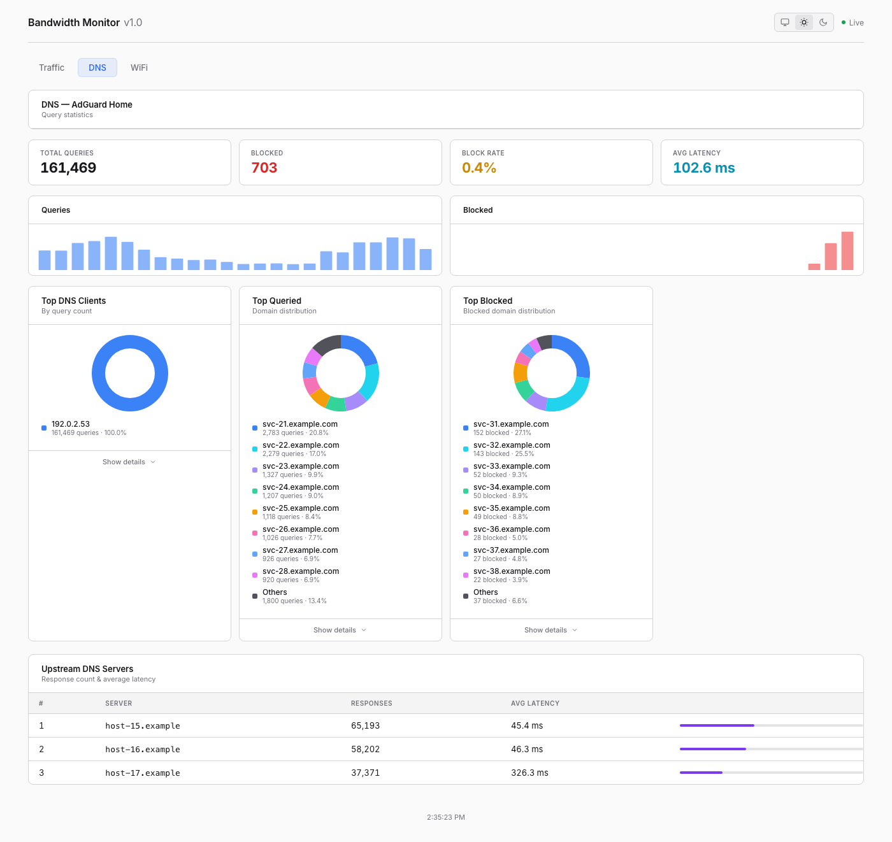

# Bandwidth Monitor

Bandwidth Monitor is a self-hosted, real-time network dashboard for Linux. It
combines interface traffic, top talkers, connection tracking, latency, network
diagnostics, and optional DNS and WiFi controller data in one embedded web UI.

The project also ships **bandwidth-top**, an independently packaged terminal
traffic viewer. It captures traffic directly and does not need the dashboard
daemon.

## Screenshots

<table>
  <tr>
    <td></td>
    <td></td>
  </tr>
  <tr>
    <td></td>
    <td></td>
  </tr>
</table>

More views are available in the [`docs/` screenshot gallery](docs/).

## Highlights

- **Live traffic:** per-interface rates and history, top talkers, host details,
  protocol and IP-version breakdowns, reverse DNS, and optional GeoIP data.
- **Network visibility:** conntrack/NAT state, client topology, continuous
  latency checks, and a live traffic map.
- **Diagnostics:** server-side speed tests, traceroute, DNS comparison and
  resolver checks, path MTU discovery, public address checks, and TCP tests.
- **Optional integrations:** AdGuard Home, NextDNS, or Pi-hole for DNS;
  UniFi or Omada for WiFi.
- **Small deployment footprint:** one Go binary with an embedded web UI.
- **Companion clients:** SwiftBar/xbar, Windows tray, GNOME/AppIndicator, and
  an independent [iOS client](https://github.com/yeled/bandwidth-monitor-ios).

## Quick start

Bandwidth Monitor runs on Linux and needs packet-capture and netlink
permissions for all features. Building requires Go 1.25 or newer.

```bash
git clone https://github.com/awlx/bandwidth-monitor.git
cd bandwidth-monitor
make build
sudo ./bandwidth-monitor
```

Open [http://localhost:8080](http://localhost:8080). Optional GeoIP databases
can be downloaded with `make geoip` before starting the daemon.

For a persistent `/opt` installation with the included systemd service:

```bash
make install
sudoedit /opt/bandwidth-monitor/.env
sudo systemctl restart bandwidth-monitor
```

See [Installation](docs/installation.md) for packages, OpenWrt, NixOS, manual
systemd setup, and GeoIP options.

## bandwidth-top

`bandwidth-top` is an iftop-style viewer for ad-hoc inspection of one Linux or
macOS interface. It ranks local/remote flows with outbound and inbound lines,
rolling 2-, 10-, and 40-second rates, total TX/RX rates, and traffic amounts
since start. It can resolve local and remote endpoint PTR names and enrich
remote peers with ASN, provider, and location data. The dashboard daemon
remains Linux-only.

In an interactive terminal, press `n` to enable or disable PTR lookups, `h` or
`?` for help (`h`, `?`, or Esc closes it), and `q` or Ctrl-C to quit.
`--no-resolve`/`-n` starts with
PTR lookups disabled; the runtime `n` key can enable them later.

Build and run it normally:

```bash
make build-top
sudo ./bandwidth-top --interface <name>
```

Or disable public peer enrichment:

```bash
sudo ./bandwidth-top --interface <name> --no-public
```

When `--interface` is omitted, the active primary default-route interface is
selected automatically. Local MMDB files are used when available.
The CLI can also discover a ready Bandwidth Monitor service on the selected
default gateway and use its `/api/host` endpoint. Missing data otherwise falls
back to `ip.ffmuc.net` unless `--no-public` is set.

> **Privacy:** public enrichment sends every observed globally routable peer IP
> that needs fallback data to `ip.ffmuc.net`. `--no-public` prevents that
> disclosure. Gateway discovery itself sends no observed peer IP; use
> `--no-server-discovery` to disable the gateway probe as well.

Common options:

| Option | Default | Purpose |
|---|---|---|
| `--interface`, `-i` | Default route | Interface to capture |
| `--local-network` | Interface prefixes | Local CIDR override; repeatable |
| `--rows`, `-L` | `20` | Maximum displayed peers |
| `--refresh` | `1s` | Refresh interval |
| `--snapshot`, `-t` | Off | Print one plain snapshot and exit |
| `--ports`, `-P` | Off | Aggregate by remote port/protocol; non-initial fragments use port `-` |
| `--no-resolve`, `-n` | Off | Disable PTR lookups and show raw endpoint IPs |
| `--version`, `-v` | Off | Print the built version and exit |
| `--server` | Gateway discovery | Explicit Bandwidth Monitor URL |
| `--no-server-discovery` | Off | Disable the default-gateway probe |
| `--no-public` | Off | Disable public enrichment fallback |

On Linux, `bandwidth-top` requires root or `CAP_NET_RAW`. To run an installed
binary without root:

```bash
sudo setcap cap_net_raw+ep /usr/bin/bandwidth-top
```

On macOS, packet capture uses native Berkeley Packet Filter devices without
CGo or libpcap. It generally requires root or administrator-managed read/write
access to `/dev/bpf*`; never make those devices world-accessible. Ethernet
(including 802.1Q/802.1ad VLAN), null/loopback, and raw-IP BPF link types are
understood. Other link types fail with an explicit unsupported-link error.
The CLI validates that the selected capture interface is active,
non-loopback, and has an assigned IPv4 or IPv6 prefix.

The `bandwidth-top` and `bandwidth-monitor` packages are independent: installing
the terminal viewer does not install or start the daemon.

## Installation

Prebuilt daemon and CLI packages are published separately on
[GitHub Releases](https://github.com/awlx/bandwidth-monitor/releases).
Releases also include standalone, checksummed macOS `bandwidth-top` archives for
amd64 and arm64; they do not contain the Linux-only daemon.

On macOS, the repository itself can be used as a custom Homebrew tap:

```bash
brew tap awlx/bandwidth-monitor https://github.com/awlx/bandwidth-monitor
brew install --cask awlx/bandwidth-monitor/bandwidth-top
```

See [Installation](docs/installation.md#homebrew-cask) for upgrade, uninstall,
capture-permission, and cask release-maintenance details.

### Debian and Ubuntu with APT

```bash
sudo install -d -m 0755 /etc/apt/keyrings
curl -fsSL https://awlx.github.io/bandwidth-monitor/bandwidth-monitor.gpg.key \
  | sudo gpg --dearmor -o /etc/apt/keyrings/bandwidth-monitor.gpg
echo "deb [signed-by=/etc/apt/keyrings/bandwidth-monitor.gpg] https://awlx.github.io/bandwidth-monitor stable main" \
  | sudo tee /etc/apt/sources.list.d/bandwidth-monitor.list
sudo apt update
sudo apt install bandwidth-monitor
```

Install only the terminal viewer with `sudo apt install bandwidth-top`, or
install both package names in one command.

### Manual Debian/RPM packages

Download the matching files from the latest release, then install the daemon:

```bash
sudo dpkg -i bandwidth-monitor_*.deb       # Debian/Ubuntu
sudo rpm -i bandwidth-monitor-*.rpm        # Fedora/RHEL
```

Use the corresponding `bandwidth-top` package when only the CLI is wanted.
Daemon packages use `/etc/bandwidth-monitor/env`.

### OpenWrt

Stable releases use `.ipk` packages:

```bash
opkg update
opkg install kmod-nf-conntrack-netlink
opkg install /tmp/bandwidth-monitor_*.ipk
/etc/init.d/bandwidth-monitor enable
/etc/init.d/bandwidth-monitor start
```

Snapshots use `.apk` packages:

```bash
apk update
apk add kmod-nf-conntrack-netlink
apk add --allow-untrusted /tmp/bandwidth-monitor-*.apk
/etc/init.d/bandwidth-monitor enable
/etc/init.d/bandwidth-monitor start
```

Install the matching `bandwidth-top` `.ipk` or `.apk` independently if desired.

### Nix

Run either application directly:

```bash
nix run github:awlx/bandwidth-monitor
nix run github:awlx/bandwidth-monitor#bandwidth-top
```

A NixOS module is included as
`github:awlx/bandwidth-monitor#nixosModules.default`. See
[Installation](docs/installation.md#nixos-module) for a configuration example.

## Configuration

Configuration is read from environment variables. Start with
[`env.example`](env.example), the canonical list of supported settings and
examples.

| Installation | Configuration file |
|---|---|
| Debian, RPM, or OpenWrt package | `/etc/bandwidth-monitor/env` |
| `make install` or manual `/opt` install | `/opt/bandwidth-monitor/.env` |
| NixOS module | `services.bandwidth-monitor` options or an environment file |

The default `LISTEN=:8080` serves the dashboard on all interfaces; a
comma-separated list binds only the addresses given, e.g.
`LISTEN=192.0.2.9:8080,[2001:db8::9]:8080`. A typical minimal configuration
limits capture to selected interfaces and optionally enables one DNS and one
WiFi provider:

```bash
LISTEN=:8080
INTERFACES=eth0,ppp0,wg0

ADGUARD_URL=http://adguard.example.local
ADGUARD_USER=monitor
ADGUARD_PASS=change-me

UNIFI_URL=https://unifi.example.local:8443
UNIFI_USER=monitor
UNIFI_PASS=change-me
```

Only one DNS provider and one WiFi provider are active; the first configured
provider in each group is used. Their tabs stay hidden when no provider is
configured.

Useful common settings:

| Setting | Purpose |
|---|---|
| `LISTEN`, `LISTEN_PROTOCOL` | Bind address(es) and HTTP/HTTPS mode |
| `TLS_CERT_FILE`, `TLS_KEY_FILE` | PEM certificate and key for HTTPS |
| `INTERFACES` | Interfaces shown and captured |
| `WAN_INTERFACE` | Override WAN auto-detection |
| `COLLECTOR_INTERVAL` | Interface-statistics polling interval (default `1s`) |
| `GEO_CITY`, `GEO_ASN` | MaxMind MMDB paths |
| `LOCAL_NETS`, `SPAN_DEVICE` | Direction detection for routed or mirror traffic |
| `LATENCY_MONITORING` | Set to `false` to disable latency monitoring |
| `LATENCY_TARGETS` | Hosts probed by the latency monitor |
| `SPEEDTEST_SERVER` | Speed test endpoint |

See [Configuration](docs/configuration.md) for TLS, conntrack accounting,
SPAN/mirror ports, VPN status files, and provider examples.

## Permissions and privacy

| Feature | Required permission |
|---|---|
| Interface stats and conntrack/NAT | `CAP_NET_ADMIN` or root |
| Top talkers, SPAN mode, `bandwidth-top` | `CAP_NET_RAW` or root |
| ICMP latency and traceroute | `CAP_NET_RAW` or root |

The included systemd services grant `CAP_NET_RAW` and `CAP_NET_ADMIN` without
running the daemon as root. Keep configuration files mode `0600`: they may
contain controller passwords, API keys, and TLS or APNs key paths.

Bandwidth Monitor has no telemetry, analytics, crash reporting, or update
checks. It does make network requests for configured integrations and these
built-in functions:

| Function | When | Information sent |
|---|---|---|
| Latency monitor | Continuously, using configurable targets | ICMP echo and HTTPS requests |
| Speed test | When started by a user | Random download/upload test data |
| DNS and resolver diagnostics | When started by a user | The entered domain and DNS queries |
| Public-address display in companion widgets | Enabled by default in those widgets | Requests revealing the monitor's public address |
| `bandwidth-top` public enrichment | Enabled unless `--no-public` | **Observed globally routable peer IPs** |

Local GeoIP lookup does not disclose peer addresses. See
[Integrations and external services](docs/integrations.md#external-services)
for endpoints and opt-out controls.

## Companion clients and API

- **macOS:** `swiftbar/bandwidth-monitor.5s.sh` for SwiftBar or xbar.
- **Windows:** `windows/bandwidth-monitor-tray.ps1` and launch helpers.
- **GNOME and AppIndicator panels:**
  `gnome/bandwidth-monitor-indicator.py`.
- **iOS:** [bandwidth-monitor-ios](https://github.com/yeled/bandwidth-monitor-ios)
  with optional Live Activity support.

Setup instructions are in [Integrations](docs/integrations.md). The dashboard
also exposes a JSON and Server-Sent Events API documented in
[API reference](docs/api.md).

## Development

```bash
go test ./...
go vet ./...
go build ./...
node static/js/utils.test.js
./packaging/test-packaging.sh
```

Linux is required for the complete networking test suite. Contributions should
keep runtime settings synchronized between `main.go`, `env.example`, and
`packaging/runtime-env.list`.

## License

Bandwidth Monitor is licensed under the
[GNU Affero General Public License v3.0](LICENSE). If you modify it and make the
program available over a network, the AGPL requires you to offer the
corresponding source code.

Bundled third-party components retain their own licenses; see
[THIRD_PARTY_LICENSES.md](THIRD_PARTY_LICENSES.md).
